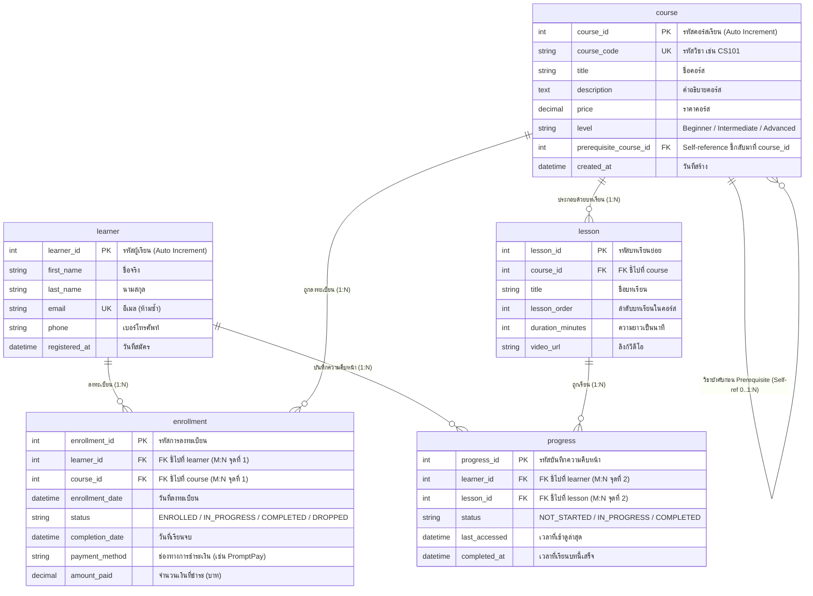

# ระบบลงทะเบียนคอร์สออนไลน์ (Online Course Registration System)

โครงงานพัฒนาระบบฐานข้อมูลและเว็บแอปพลิเคชันด้วย **Python (Flask)** ร่วมกับฐานข้อมูลเชิงสัมพันธ์ **MySQL** ครบวงจร ทั้งการออกแบบฐานข้อมูล (ER-Diagram), สคริปต์สร้างตาราง (DDL), ข้อมูลตัวอย่างสมมติ (DML), ฟังก์ชัน CRUD พร้อมความปลอดภัยจาก SQL Injection และ 3 รายงานบังคับเชิงวิเคราะห์

---

## สารบัญ
1. [โครงสร้างโปรเจกต์ (Project Structure)](#1-โครงสร้างโปรเจกต์)
2. [การติดตั้งและเริ่มต้นใช้งาน (Setup & Installation)](#2-การติดตั้งและเริ่มต้นใช้งาน)
3. [เอกสารเตรียมนำเสนอครั้งที่ 1: การออกแบบฐานข้อมูล (Database Design)](#3-เอกสารเตรียมนำเสนอครั้งที่-1-การออกแบบฐานข้อมูล)
4. [เอกสารเตรียมนำเสนอครั้งที่ 2: ฟังก์ชัน CRUD และความปลอดภัย (CRUD & Security)](#4-เอกสารเตรียมนำเสนอครั้งที่-2-ฟังก์ชัน-crud-และความปลอดภัย)
5. [เอกสารเตรียมนำเสนอครั้งที่ 3: รายงานบังคับ 3 รายการ (Mandatory Reports)](#5-เอกสารเตรียมนำเสนอครั้งที่-3-รายงานบังคับ-3-รายการ)

---

## 1. โครงสร้างโปรเจกต์

```text
โปรเจคทำเว็ปคอสออนไลน์/
├── config.py              # การตั้งค่าเชื่อมต่อฐานข้อมูล MySQL (Host, Port, User, Password, DB)
├── db.py                  # Helper functions (run_query, run_command), CRUD และ SQL 3 รายงาน
├── app.py                 # ตัวควบคุมเว็บแอปพลิเคชัน Flask และจัดการ Route
├── schema.sql             # คำสั่ง SQL สร้างฐานข้อมูล 5 ตาราง พร้อมข้อมูลตัวอย่างสมมติ
├── requirements.txt       # รายการไลบรารีที่จำเป็น (Flask, mysql-connector-python, PyMySQL)
├── .env.example             # ตัวอย่างค่าตั้งค่า (copy เป็น .env แล้วแก้ตามเครื่องตัวเอง)
├── README.md              # คู่มือและเอกสารประกอบการนำเสนอทั้ง 3 ครั้ง
└── templates/             # หน้าจอเว็บ (Jinja2 Templates) ตกแต่งด้วย Bootstrap 5
    ├── base.html          # โครงหลักและ Navbar
    ├── index.html         # หน้าหลัก ค้นหาคอร์ส และปุ่มทดสอบระบบเทมเพลต (Step 2)
    ├── courses.html       # หน้าจัดการคอร์สเรียน (เพิ่ม, แก้ไข, ลบ, กำหนด Prerequisite)
    ├── learners.html      # หน้าจัดการข้อมูลผู้เรียน
    ├── enrollments.html   # หน้าบันทึกและจัดการการลงทะเบียนเรียน (M:N) พร้อมช่องทาง/ยอดชำระเงิน
    ├── checkout.html      # หน้าชำระเงินและลงทะเบียนเรียนรายคอร์ส (ตรวจ Prerequisite แบบเรียลไทม์)
    ├── money_management.html # หน้ารายงานการเงิน (ยอดรวม/รายคอร์ส/ช่องทางชำระ/รายชื่อผู้จ่าย)
    └── reports.html       # หน้าแสดงผล 3 รายงานบังคับ พร้อมคำสั่ง SQL สำหรับนำเสนอ
```

---

## 2. การติดตั้งและเริ่มต้นใช้งาน

### ขั้นตอนที่ 1: ติดตั้ง Python และไลบรารี
1. ตรวจสอบว่าในเครื่องมี Python ติดตั้งเรียบร้อย (ดาวน์โหลดได้จาก [python.org](https://www.python.org/downloads/))
2. เปิด Terminal ใน VS Code และรันคำสั่งติดตั้งแพ็กเกจ:
   ```bash
   pip install -r requirements.txt
   ```

### ขั้นตอนที่ 2: สร้างฐานข้อมูลและตาราง
1. เปิดโปรแกรมจัดการฐานข้อมูล เช่น **DBeaver**, **MySQL Workbench** หรือ **phpMyAdmin**
2. เปิดไฟล์ `schema.sql` และรันคำสั่งทั้งหมดเพื่อสร้างฐานข้อมูล `online_course_db` พร้อมตารางและข้อมูลตัวอย่าง

### ขั้นตอนที่ 3: กำหนดค่าการเชื่อมต่อฐานข้อมูล
`config.py` จะอ่านค่าจาก Environment (ไฟล์ `.env`) ถ้ามี ถ้าไม่มีจะใช้ค่าเริ่มต้นสำหรับ Localhost:
```bash
cp .env.example .env   # แล้วแก้ค่าใน .env ตามเครื่องตัวเอง (ถ้าจำเป็น)
```
```python
DB_HOST = "127.0.0.1"      # หรือ IP Server ของอาจารย์
DB_PORT = 3306
DB_USER = "root"           # ชื่อผู้ใช้ฐานข้อมูล
DB_PASSWORD = "67676767"   # รหัสผ่านฐานข้อมูล (ค่าเริ่มต้นของโปรเจค)
DB_NAME = "online_course_db"
```

### ขั้นตอนที่ 4: รันเว็บแอปพลิเคชัน
1. รันคำสั่งเปิดเซิร์ฟเวอร์:
   ```bash
   python app.py
   ```
2. เปิดเบราว์เซอร์ไปที่: [http://127.0.0.1:5000](http://127.0.0.1:5000)
3. **การทดสอบตามสเปกของอาจารย์:**
   - ที่หน้าแรก หากคลิกปุ่ม **"กดค้นหาแบบจำลอง (ยังไม่ได้เขียน SQL)"** ระบบจะแสดงข้อความเตือนว่า *"ยังไม่ได้เขียน SQL"* เพื่อใช้ยืนยันการรันเทมเพลตสำเร็จตามขั้นตอนที่ 2

---

## 3. เอกสารเตรียมนำเสนอครั้งที่ 1: การออกแบบฐานข้อมูล

### 3.1 ER Diagram (Entity-Relationship Diagram)



### 3.2 จุดเด่นของการออกแบบตามข้อกำหนด
1. **Self-Reference Relationship (วิชาบังคับก่อน - Prerequisite):**
   - ในตาราง `course` มีฟิลด์ `prerequisite_course_id` ซึ่งเป็น Foreign Key ชี้กลับมาที่ `course_id` ในตาราง `course` เดียวกัน
   - หากเป็นคอร์สระดับต้นจะเก็บค่า `NULL`
   - หากเป็นคอร์สระดับกลาง/สูงจะเก็บ `course_id` ของวิชาพื้นฐาน เช่น *CS102 Data Structures* มี Prerequisite คือ *CS101 Python Basics*
2. **ความสัมพันธ์ Many-to-Many (M:N) 2 จุด:**
   - **จุดที่ 1:** ผู้เรียน 1 คน ลงทะเบียนได้หลายคอร์ส และ คอร์ส 1 คอร์ส มีผู้เรียนลงทะเบียนได้หลายคน ผ่านตารางเชื่อม `enrollment`
   - **จุดที่ 2:** ผู้เรียน 1 คน บันทึกความคืบหน้าได้หลายบทเรียน และ บทเรียน 1 บทเรียน มีผู้เรียนเข้าเรียนได้หลายคน ผ่านตารางเชื่อม `progress`
3. **Data Integrity & Constraints:**
   - มี `UNIQUE KEY (learner_id, course_id)` เพื่อป้องกันไม่ให้ผู้เรียนลงทะเบียนวิชาเดิมซ้ำ
   - มี `UNIQUE KEY (learner_id, lesson_id)` ในตาราง progress
   - มี `ON DELETE CASCADE` และ `ON DELETE SET NULL` เหมาะสมตาม Business Logic

---

## 4. เอกสารเตรียมนำเสนอครั้งที่ 2: ฟังก์ชัน CRUD และความปลอดภัย

### 4.1 ฟังก์ชันพื้นฐานใน `db.py`
- **`run_query(sql, params=None)`**: รันคำสั่ง `SELECT` โดยส่งค่าคืนเป็น List of Dictionaries
- **`run_command(sql, params=None)`**: รันคำสั่ง `INSERT`, `UPDATE`, `DELETE` พร้อมทำ `conn.commit()` อัตโนมัติ

### 4.2 การป้องกัน SQL Injection
ทุกฟังก์ชันใน `db.py` มีการส่งค่าผ่านพารามิเตอร์แบบ `%s` (Parameterized Queries / Prepared Statements) อย่างเคร่งครัด **ไม่มีการนำ String มาบวกต่อกัน (`+`)** เช่น:
```python
# ตัวอย่างที่ถูกต้องและปลอดภัย (ใช้ใน db.py):
sql = "SELECT * FROM course WHERE level = %s AND price <= %s;"
results = run_query(sql, (level, max_price))

# ตัวอย่างที่ไม่ปลอดภัย (ห้ามทำเด็ดขาด):
# sql = "SELECT * FROM course WHERE level = '" + level + "';"
```

### 4.3 การตรวจสอบเงื่อนไขวิชาบังคับก่อน (Prerequisite Validation)
ระบบมีการบังคับใช้กฎ Business Logic สำหรับวิชาที่มีการกำหนด Prerequisite (`prerequisite_course_id`):
1. **การตรวจสอบเงื่อนไขผ่านวิชาบังคับก่อน (`check_prerequisite_satisfied`):**
   - ก่อนจะทำการลงทะเบียน (ทั้งหน้าชำระเงิน `/checkout` และหน้าการลงทะเบียน `/enrollments`) ระบบจะตรวจสอบว่าผู้เรียนเคยลงทะเบียนวิชาบังคับก่อนและมีสถานะเป็น `COMPLETED` หรือไม่
   - หากผู้เรียนยังไม่ได้ลงทะเบียน หรือยังเรียนไม่จบ (สถานะ `ENROLLED`, `IN_PROGRESS`, `DROPPED`) ระบบจะปฏิเสธการลงทะเบียน พร้อมแจ้งเตือนชื่อวิชาและสถานะปัจจุบัน
2. **การป้องกันการลงทะเบียนซ้ำ (`is_already_enrolled`):**
   - ป้องกันไม่ให้ผู้เรียนคนเดิมลงทะเบียนคอร์สเดิมซ้ำซ้อน
3. **การตรวจสอบแบบ Real-time บนหน้าเว็บ:**
   - หน้ารับชำระเงิน `/checkout` จะแสดงสัญลักษณ์สถานะของผู้เรียนแต่ละคนใน Dropdown และแสดงกล่องเตือนสีแดงพร้อมปิดการทำงานของปุ่มชำระเงินทันทีหากผู้เรียนติดเงื่อนไขวิชาบังคับก่อน
   - หน้า `/enrollments` มี Modal ที่เรียก API `/api/check-prerequisite` เพื่อแจ้งเตือนแบบเรียลไทม์

---

### 4.4 หน้ารายงานการเงินเพิ่มเติม (`/money-management`)
นอกเหนือจาก 3 รายงานบังคับ ระบบมีหน้ารายงานการเงินที่ใช้คอลัมน์ `payment_method` และ `amount_paid` ของตาราง `enrollment` โดยตรง:
- สรุปยอด (`report_money_management_summary`): จำนวนธุรกรรม, ยอดรายได้รวม (ไม่นับสถานะ `DROPPED`), จำนวนคนกำลังเรียน/เรียนจบ/เพิ่งลงทะเบียน
- รายได้แยกตามคอร์ส (`report_money_by_course`) และแยกตามช่องทางชำระเงิน (`report_money_by_payment_method`)
- รายชื่อผู้เรียนที่ชำระเงินแล้ว (`report_paid_learners_status`)

---

## 5. เอกสารเตรียมนำเสนอครั้งที่ 3: รายงานบังคับ 3 รายการ

### รายงานที่ 1: คอร์สยอดนิยม ตามจำนวนผู้ลงทะเบียน
- **วัตถุประสงค์:** จัดอันดับคอร์สที่มีผู้เรียนสนใจลงทะเบียนมากที่สุด
- **เทคนิค:** `JOIN` + `GROUP BY` + `COUNT`
- **คำสั่ง SQL:**
```sql
SELECT 
    c.course_id,
    c.course_code,
    c.title AS course_title,
    c.level,
    c.price,
    COUNT(e.enrollment_id) AS total_enrolled
FROM course c
LEFT JOIN enrollment e ON c.course_id = e.course_id
GROUP BY 
    c.course_id, 
    c.course_code, 
    c.title, 
    c.level, 
    c.price
ORDER BY total_enrolled DESC, c.course_code ASC;
```

### รายงานที่ 2: อัตราการเรียนจบ ของแต่ละคอร์สจากสถานะใน enrollment
- **วัตถุประสงค์:** วิเคราะห์สัดส่วนความสำเร็จของผู้เรียนในแต่ละคอร์ส เพื่อดูว่าคอร์สใดยากหรือง่ายเกินไป
- **เทคนิค:** `GROUP BY` + `CASE WHEN` + การคำนวณสัดส่วน %
- **คำสั่ง SQL:**
```sql
SELECT 
    c.course_id,
    c.course_code,
    c.title AS course_title,
    COUNT(e.enrollment_id) AS total_enrolled,
    SUM(CASE WHEN e.status = 'COMPLETED' THEN 1 ELSE 0 END) AS total_completed,
    SUM(CASE WHEN e.status = 'IN_PROGRESS' THEN 1 ELSE 0 END) AS total_in_progress,
    SUM(CASE WHEN e.status = 'DROPPED' THEN 1 ELSE 0 END) AS total_dropped,
    ROUND(
        (SUM(CASE WHEN e.status = 'COMPLETED' THEN 1 ELSE 0 END) * 100.0) 
        / NULLIF(COUNT(e.enrollment_id), 0), 2
    ) AS completion_rate_percentage
FROM course c
JOIN enrollment e ON c.course_id = e.course_id
GROUP BY 
    c.course_id, 
    c.course_code, 
    c.title
ORDER BY completion_rate_percentage DESC, total_enrolled DESC;
```

### รายงานที่ 3: คอร์สพร้อมชื่อวิชาที่เป็น Prerequisite
- **วัตถุประสงค์:** แสดงผังวิชาต่อเนื่อง ให้ผู้เรียนและอาจารย์เห็นชัดเจนว่าแต่ละคอร์สต้องผ่านวิชาใดมาก่อน
- **เทคนิค:** `Self-JOIN` ของตาราง `course` โดยเชื่อมตารางตัวเอง `course c` กับ `course p`
- **คำสั่ง SQL:**
```sql
SELECT 
    c.course_id,
    c.course_code,
    c.title AS course_title,
    c.level AS course_level,
    c.price,
    p.course_code AS prerequisite_code,
    COALESCE(p.title, 'ไม่มีวิชาบังคับก่อน') AS prerequisite_title,
    COALESCE(p.level, '-') AS prerequisite_level
FROM course c
LEFT JOIN course p ON c.prerequisite_course_id = p.course_id
ORDER BY c.course_id ASC;
```
